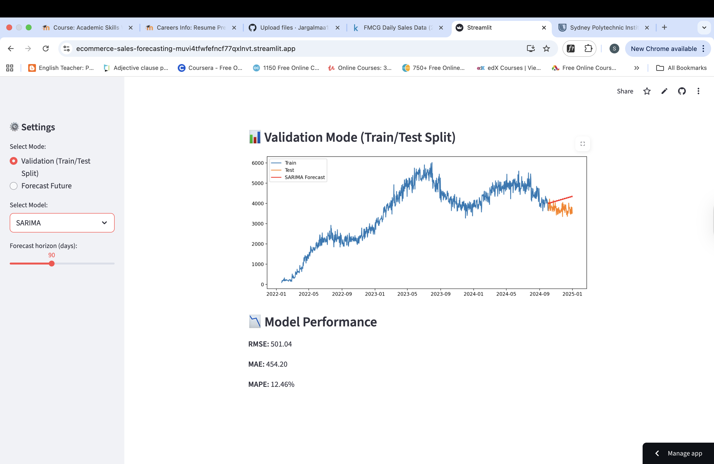

# 🛒 E-Commerce Sales Forecasting  

## 📌 Overview  
This project is about predicting future sales for an e-commerce / FMCG business using real transaction data. The idea is simple: if we can forecast demand more accurately, businesses can plan their **inventory, marketing, and revenue strategies** much better.  

## 🎯 What I Did  
- Cleaned and prepared daily sales data  
- Looked at **trends, seasonal patterns, and spikes** through exploratory analysis  
- Built three forecasting models: **ARIMA, Prophet, and XGBoost**  
- Compared them using standard error metrics (**RMSE, MAE, MAPE**)  
- Created an **interactive Streamlit app** where users can test different models and forecast horizons  
- Wrote up insights to explain not just “what the models predicted” but **what that means for business**  

## 📂 Project Layout  
ecommerce-sales-forecasting/
├── data/ # datasets
├── notebooks/ # EDA + model training
├── dashboard/ # Streamlit app
├── visuals/ # charts and screenshots
├── requirements.txt
└── README.md

## 🛠 Tools Used  
- **Python** (pandas, numpy, scikit-learn, statsmodels, XGBoost, Prophet)  
- **Visualization**: matplotlib, seaborn, plotly  
- **Dashboard**: Streamlit  
- **Version Control**: GitHub  

## 📊 Workflow  
1. Clean and organize raw data  
2. Explore sales behavior (weekly cycles, seasonal peaks)  
3. Train ARIMA, Prophet, and XGBoost models  
4. Deploy an interactive Streamlit dashboard  
5. Summarize technical results into **business-focused insights**  

## 🔮 Model Insights  
- **Prophet**: Best at picking up **seasonality and long-term patterns**  
- **ARIMA**: Works fine for **short-term forecasts**, but weak for long horizons  
- **XGBoost**: Very strong in validation, but when forecasting into the future it tends to **flatten** because it depends heavily on lag features  

👉 **Takeaway:**  
- Prophet = reliable for **long-term planning**  
- XGBoost = useful for **short-term weekly demand**  
- A combination of the two could give the best of both worlds  

## 📈 Dashboard  
The dashboard makes it easy to:  
- Pick a forecasting model (Prophet / ARIMA / XGBoost)  
- Adjust the forecast horizon (30–180 days)  
- Check validation metrics (RMSE, MAE, MAPE)  
- Switch between **train/test validation** and **future forecasts**  

  

👉 **Live App:** [E-Commerce Forecasting Dashboard](https://ecommerce-sales-forecasting-muvi4tfwfefncf77qxlnvt.streamlit.app/)  

## 🚀 Status & Next Steps  
- ✅ Models are trained, tested, and the app is live  
- 🔄 Next, I’d like to experiment with hybrid approaches and add holiday/promotion effects into the forecasts  

## 📌 What I Learned  
- How to build an **end-to-end forecasting pipeline**  
- The pros and cons of traditional vs machine learning models  
- That the “best” model depends on whether you need **accuracy now** (short-term) or **pattern recognition later** (long-term)  
- How to turn technical results into something **decision-makers can use**  
