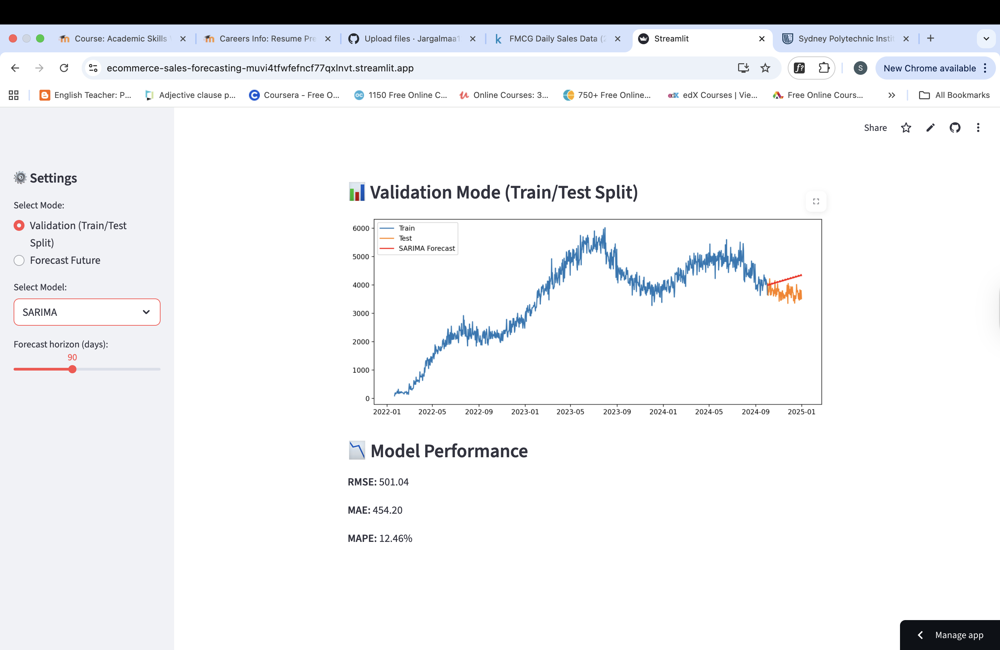

# 🛒 E-Commerce Sales Forecasting  

## 📌 Project Overview  
This project focuses on forecasting future sales for an e-commerce / FMCG platform using real transaction data.  
The goal is to help businesses optimize **inventory, marketing campaigns, and revenue planning** by predicting sales trends with **time series and machine learning models**.  

## 🎯 Objectives  
- Clean and prepare raw sales data  
- Explore seasonal trends, spikes, and anomalies  
- Build forecasting models (**ARIMA, Prophet, XGBoost**)  
- Compare model performance with metrics (**MAE, RMSE, MAPE**)  
- Develop an **interactive Streamlit dashboard** to visualize predictions  
- Translate technical results into **business insights**  

## 📂 Project Structure  
ecommerce-sales-forecasting/
│── data/ # raw and processed datasets
│── notebooks/ # Jupyter notebooks (EDA, modeling, forecasting)
│── dashboard/ # Streamlit app files
│── visuals/ # charts, plots, screenshots
│── requirements.txt # Python dependencies
│── README.md # project documentation

## 🛠 Tools & Technologies  
- **Python** (pandas, numpy, scikit-learn, statsmodels, XGBoost, Prophet)  
- **Visualization**: matplotlib, seaborn, plotly  
- **Dashboard**: Streamlit  
- **Version Control**: GitHub  

## 📊 Workflow  
1. **Data Preparation** – Cleaned and aggregated daily sales  
2. **Exploratory Data Analysis (EDA)** – Identified seasonality, trends, anomalies  
3. **Modeling & Forecasting** – Implemented ARIMA, Prophet, XGBoost  
4. **Dashboard** – Interactive app for forecasts & model comparison  
5. **Insights** – Translated results into actionable business strategies  

## 🔮 Model Comparison  

| Model    | Strengths | Limitations |
|----------|-----------|-------------|
| **Prophet** | Captures **trend + seasonality**, produces realistic future patterns | Assumes seasonality continues unchanged |
| **ARIMA**   | Strong for **short-term forecasts** | Weaker at handling strong seasonality, degrades in long horizons |
| **XGBoost** | Very **accurate in validation** (low RMSE/MAE), learns from lag features | In **future forecasting**, predictions flatten (steady line) because lag values repeat beyond dataset |

✅ **Business Takeaway**:  
- Use **Prophet** for long-term planning (inventory, marketing).  
- Use **XGBoost** for short-term weekly demand predictions.  
- Hybrid Prophet + XGBoost could provide the best of both worlds.  

## 📈 Dashboard Preview  

The interactive **Streamlit app** lets users:  
- Select forecasting model (Prophet / ARIMA / XGBoost)  
- Adjust forecast horizon (30–180 days)  
- Compare model performance (RMSE, MAE, MAPE)  
- Switch between **validation mode** and **future forecasting mode**  

 

👉 Try it live: https://ecommerce-sales-forecasting-muvi4tfwfefncf77qxlnvt.streamlit.app/

## 🚀 Status  
✅ Modeling completed and dashboard deployed.  
🔄 Future work: experiment with hybrid models, add holiday/promotion effects.  

## 📌 Key Learning Outcomes  
- Built an **end-to-end ML forecasting pipeline**  
- Understood trade-offs between classical time-series and ML models  
- Deployed results in an **interactive app for business use** 
